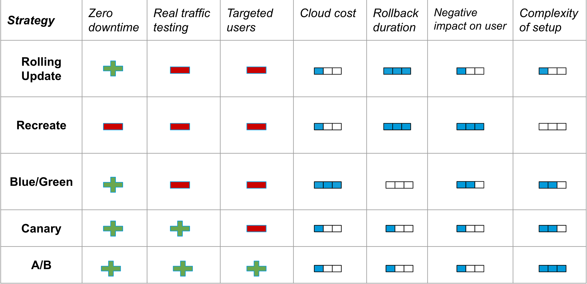

# Kubernetes: Deployment Strategies

> In Kubernetes there is few different way to release an application, you have
to carefully choose the right strategy to make your infrastructure resilient.

- [recreate](./recreate/): terminate the old version and release the new one
- [rollout update](./rollout_update/): release a new version on a rolling update fashion, one
  after the other
- [blue/green](./blue_green/): release a new version alongside the old version
  then switch traffic
- [canary](./canary/): release a new version to a subset of users, then proceed
  to a full rollout
- [a/b testing](/ab_testing/): release a new version to a subset of users in a
  precise way (HTTP headers, cookie, weight, etc.). This doesn’t come out of the
  box with Kubernetes, it imply extra work to setup a smarter
  loadbalancing system (Istio, Linkerd, Traeffik, custom nginx/haproxy, etc).




## Getting started

These examples requires the instalation of 
- [Minikube](#minikube)
- [Kubernetes Dashboard](#kubernetes-dashboard)

### Minikube

`Minikube` is local Kubernetes, focusing on making it easy to learn and develop for Kubernetes.

All you need is Docker (or similarly compatible) container or a Virtual Machine environment, and Kubernetes

Please follow all steps described in *[oficial documentation of Minikube installation.](https://minikube.sigs.k8s.io/docs/start/)*

### Kubernetes Dashboard

Dashboard is a web-based Kubernetes user interface. You can use Dashboard to deploy containerized applications to a Kubernetes cluster, troubleshoot your containerized application, and manage the cluster resources. You can use Dashboard to get an overview of applications running on your cluster, as well as for creating or modifying individual Kubernetes resources (such as Deployments, Jobs, DaemonSets, etc). For example, you can scale a Deployment, initiate a rolling update, restart a pod or deploy new applications using a deploy wizard.

Please follow all steps described in *[oficial documentation.](https://kubernetes.io/docs/tasks/access-application-cluster/web-ui-dashboard/#deploying-the-dashboard-ui)*


## List of useful commands

```bash
# Proxy for kubernetes-dashboard:
$ kubectl proxy

# Get the auth token to kubectl-dashboard
$ kubectl -n kubernetes-dashboard get secret $(kubectl -n kubernetes-dashboard get sa/admin-user -o jsonpath="{.secrets[0].name}") -o go-template="{{.data.token | base64decode}}"

# Apply config file
$ kubectl apply -f <file_path>

# Set label to pod
$ kubectl label pod <pod_name> <label_name>=<value>

# Watch pods
$ kubectl get po --watch

# Forward the port 
$ kubectl port-forward <pod_name> <external port>:<internal port>

# Get Minikube IP 
$ minikube ip

# Loop to call the service 
$ service=$(minikube service <service_name> --url)
while true; do curl "$service"; sleep 2; echo; done

# Rollout logs (run after deployment start)
$ kubectl rollout status deployment <deployment_name>

# Rollout history 
$ kubectl rollout history deployment <deployment_name>

# Rollback rollout (--to-revision=n)
$ kubectl rollout undo deployment <deployment_name>

# Cleanup
$ kubectl delete all -l app=<value>
```