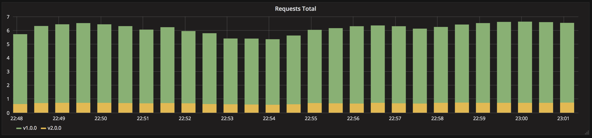

# A/B testing using Istio

> Version B is released to a subset of users under specific condition.

A/B testing deployments consists of routing a subset of users to a new
functionality under specific conditions. It is usually a technique for making
business decisions based on statistics rather than a deployment strategy.
However, it is related and can be implemented by adding extra functionality to a
canary deployment so we will briefly discuss it here.

This technique is widely used to test conversion of a given feature and only
roll-out the version that converts the most.

Here is a list of conditions that can be used to distribute traffic amongst the
versions:

- Weight
- Cookie value
- Query parameters
- Geolocalisation
- Technology support: browser version, screen size, operating system, etc.
- Language

