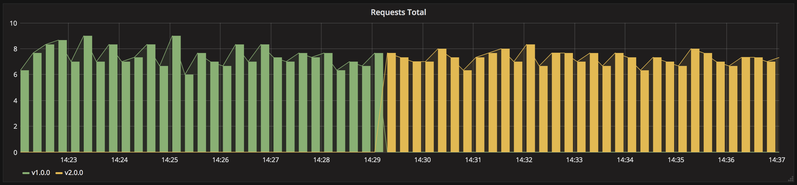
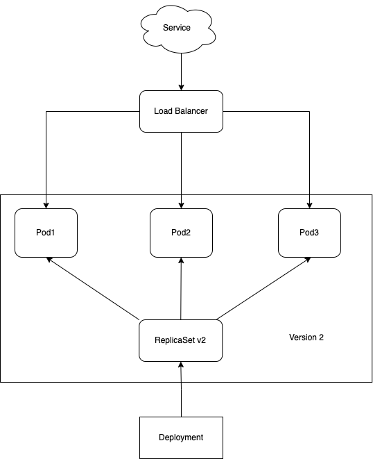

# Blue/green deployment

> Version B is released alongside version A, then the traffic is switched to
version B. Also known as red/black deployment.



The blue/green deployment strategy differs from a rollout update deployment, version B
(green) is deployed alongside version A (blue) with exactly the same amount of
instances. After testing that the new version meets all the requirements the
traffic is switched from version A to version B at the load balancer level.

**You can apply the blue/green deployment technique for a single service or
multiple services using an Ingress controller:**

## Release a single service

> In this example, we release a new version of a single service using the
blue/green deployment strategy.

## Steps to follow

1. version 1 is serving traffic
1. deploy version 2
1. wait until version 2 is ready
1. switch incoming traffic from version 1 to version 2
1. shutdown version 1

## In practice

```bash
# Deploy the first application
$ kubectl apply -f kuber-deployment-v1.yaml

# Test if the deployment was successful
$ curl $(minikube service kuber-servie --url)

# To see the deployment in action, open a new terminal and run the following command:
$ watch kubectl get po --watch

# Then deploy version 2 of the application
$ kubectl apply -f kuber-deployment-v2.yaml

# Wait for all the version 2 pods to be running
$ kubectl rollout status deploy kuber-v2 -w
deployment "kuber-v2" successfully rolled out

# Side by side, 3 pods are running with version 2 but the service still send
# traffic to the first deployment.

# If necessary, you can manually test one of the pod by port-forwarding it to
# your local environment.

# Once your are ready, you can switch the traffic to the new version by patching
# the service to send traffic to all pods with label version=v2.0
$ kubectl patch service kuber-service -p '{"spec":{"selector":{"version":"v2.0"}}}'

# Test if the second deployment was successful
service=$(minikube service kuber-service --url)
while true; do curl "$service"; sleep 2; echo; done

# In case you need to rollback to the previous version
$ kubectl patch service kuber-service -p '{"spec":{"selector":{"version":"v1.0"}}}'

# If everything is working as expected, you can then delete the v1.0 deployment
$ kubectl delete deploy kuber-v1

# Cleanup

$ kubectl delete all -l app=kuber
```

## Visualize step by step 

### Init state


### Step 1


### Step 2


### Step 3

