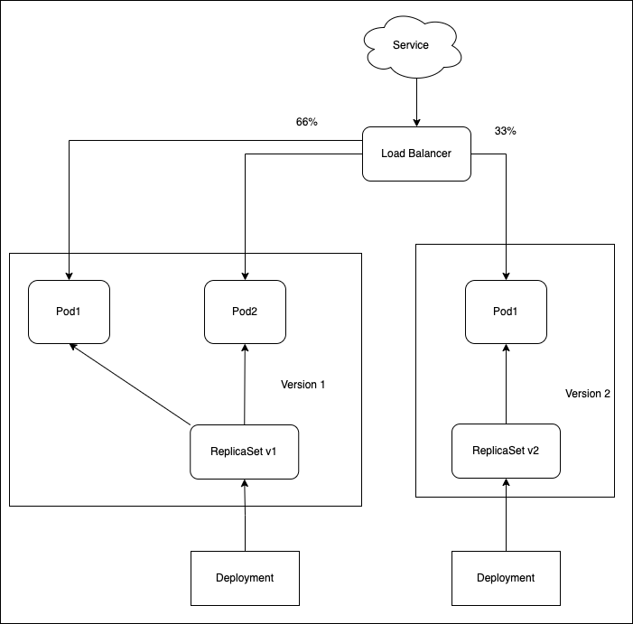
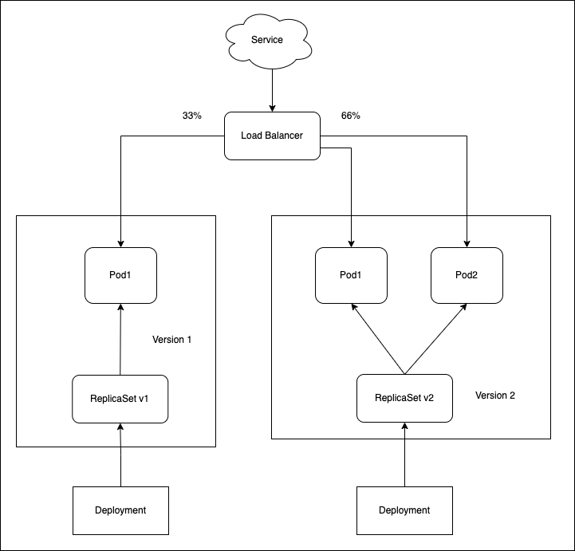
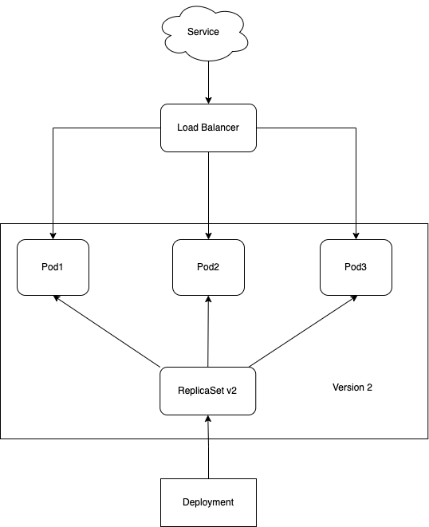

# Canary deployment

> Version B is released to a subset of users, then proceed to a full rollout.


A canary deployment consists of gradually shifting production traffic from
version A to version B. Usually the traffic is split based on weight. For
example, 90 percent of the requests go to version A, 10 percent go to version B.

This technique is mostly used when the tests are lacking or not reliable or if
there is little confidence about the stability of the new release on the
platform.

**You can apply the canary deployment technique using the native way by
adjusting the number of replicas or if you use Nginx as Ingress controller you
can define fine grained traffic splitting via Ingress annotations.**

## Canary deployment using Kubernetes native functionnalities

> In the following example, we apply the canary using Kubernetes native features (replicas).

## Steps to follow

1. 3 replicas of version 1 is serving traffic
1. deploy 1 replicas version 2 (meaning ~33% of traffic)
1. wait enought time to confirm that version 2 is stable and not throwing unexpected errors
1. scale up version 2 replicas to 3
1. wait until all instances are ready
1. shutdown version 1

## In practice

```bash
# Deploy the first application
$ kubectl apply -f kuber-deployment-v1.yaml

# Test if the deployment was successful
$ curl $(minikube service kuber-service --url)

# To see the deployment in action, open a new terminal and run a watch command.
# It will show you a better view on the progress
$ watch kubectl get po

# Then deploy version 2 of the application and scale down version 1 to 2 replicas at same time
$ kubectl apply -f kuber-deployment-v2.yaml
$ kubectl scale --replicas=2 deploy kuber-v1

# Only one pod with the new version should be running.
# You can test if the second deployment was successful
$ service=$(minikube service kuber-service --url)
$ while sleep 0.1; do curl "$service"; done

# If you are happy with it, scale up the version 2 to 10 replicas
$ kubectl scale --replicas=3 deploy kuber-v2

# Then, when all pods are running, you can safely delete the old deployment
$ kubectl delete deploy kuber-v1

# Cleanup

$ kubectl delete all -l app=my-app
```


## Visualize step by step 

### Init state


### Step 1



### Step 2



### Step 3

