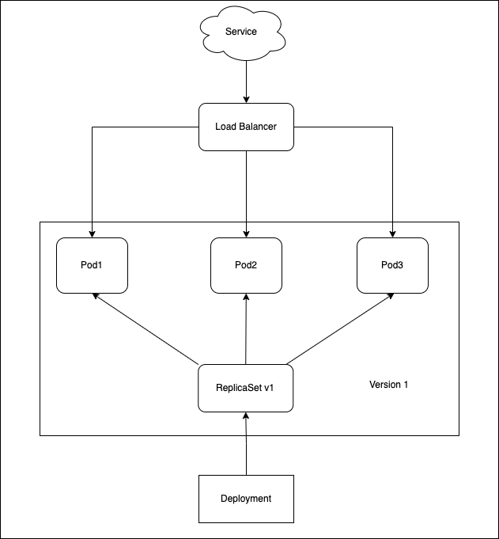

# RolloutUpdate deployment


> Version B is slowly rolled out and replacing version A. Also known as
ramped or incremental.


The rollout deployment strategy consists of slowly rolling out a version of an
application by replacing instances one after the other until all the instances
are rolled out. It usually follows the following process: with a pool of version
A behind a load balancer, one instance of version B is deployed. When the
service is ready to accept traffic, the instance is added to the pool. Then, one
instance of version A is removed from the pool and shut down.

Depending on the system taking care of the rollout update deployment, you can tweak the
following parameters to increase the deployment time:

- Parallelism, max batch size: Number of concurrent instances to roll out.
- Max surge: How many instances to add in addition of the current amount.
- Max unavailable: Number of unavailable instances during the rolling update
  procedure.

## Steps to follow

1. version 1 is serving traffic
1. deploy version 2
1. wait until all replicas are replaced with version 2

## In practice

```bash
# Deploy the first application
$ kubectl apply -f kuber-deployment-v1.yaml

# Test if the deployment was successful
$ curl $(minikube service kuber-service --url)

# To see the deployment in action, open a new terminal and run the following command
$ watch kubectl get po --watch

# Then deploy version 2 of the application
$ kubectl apply -f kuber-deployment-v2.yaml

# Test the second deployment progress
service=$(minikube service kuber-service --url)
while true; do curl "$service"; sleep 2; echo; done

# In case you discover some issue with the new version, you can undo the rollout
$ kubectl rollout undo deploy kuber

# If you can also pause the rollout if you want to run the application for a subset of users
$ kubectl rollout pause deploy kuber

# Then if you are satisfy with the result, rollout
$ kubectl rollout resume deploy kuber

# Cleanup
kubectl delete all -l app=kuber
```

## Visualize step by step 

### Init state



### Step 1


### Step 2


### Step 3


### Step 4

